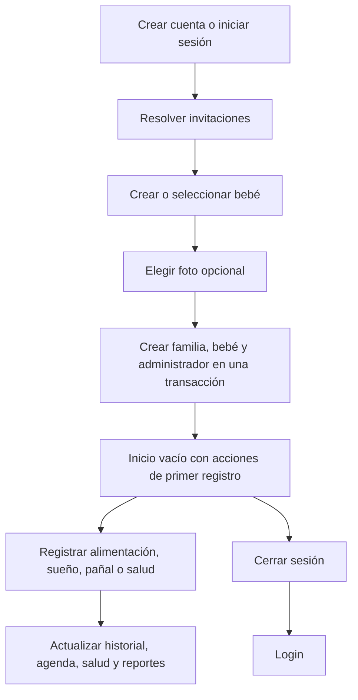

# Auditoría de cuenta, onboarding y primera experiencia

## Resultado objetivo

Una cuenta nueva debe mostrar exclusivamente la información creada por esa
persona. Después de registrar el primer bebé, Inicio, Agenda, Salud y Familia
parten sin actividad clínica o de cuidado y explican qué registrar a
continuación. Ningún fixture, bebé demo o valor sintético puede entrar en el
flujo productivo.

## Flujo funcional

## UX

- La app diferencia ausencia de información, carga y error. Un valor `0` no se
  usa para representar información todavía no registrada.
- Los estados vacíos explican por qué no hay contenido y ofrecen una acción
  concreta. Se evita una pantalla que parece completa con datos ajenos.
- El selector de foto permite elegir, previsualizar, cambiar y quitar la imagen
  antes de confirmar el perfil.
- Cerrar sesión siempre abandona el área privada y vuelve a Login. La limpieza
  secundaria de notificaciones no puede bloquear esa salida.
- El splash nativo termina al primer frame de Flutter. La inicialización pesada
  ocurre sobre una superficie de marca animada y el splash funcional conserva
  una duración mínima perceptible.
- El cambio de tema responde de inmediato y persiste después; la escritura
  local no bloquea ni devuelve visualmente el selector a la posición anterior.
- Los títulos de sección conservan una línea. Cuando comparten espacio con una
  acción, escalan de forma controlada antes de envolver el texto.
- Los carruseles ocupan el ancho disponible. El primer elemento comienza con
  inset izquierdo, pero ese espacio pertenece al scroll y desaparece al
  avanzar. El último elemento conserva un cierre visual equivalente.

## UI y sistema de diseño

### Ilustraciones

| Asset | Uso | Semántica |
| --- | --- | --- |
| `empty_home.png` | Inicio sin registros | Primer cuidado listo para registrar |
| `empty_agenda.png` | Agenda sin eventos | Calendario disponible para el primer recordatorio |
| `empty_health.png` | Salud sin datos | Primera medición o control pendiente |

Las ilustraciones usan la paleta pastel turquesa, azul, lila y coral de los
mockups. Los controles interactivos mantienen iconos vectoriales Material o
Lucide para conservar nitidez, accesibilidad y consistencia de tamaños.

### Reglas de componentes

- `BebeTitleSection`: una línea por defecto, sin salto de palabras.
- `BebeHorizontalCardCarousel`: `padEnds: false`, inset inicial desplazable y
  sin padding exterior fijo.
- `BabyDayNightThemeSwitch`: estado visual optimista, 160 ms y curva
  `easeOutCubic`, sin rebote.
- Estados vacíos: título, explicación, ilustración semántica y CTA cuando la
  acción está disponible.
- Fotografías locales: vista circular, fallback de marca y texto alternativo
  con el nombre del bebé.

## BA: reglas e invariantes de negocio

1. Una base local productiva se identifica por la cuenta autenticada.
2. Una cuenta no puede abrir la base local de otra cuenta.
3. La creación inicial guarda familia, bebé, miembro administrador y
   configuración en una única transacción.
4. La foto es opcional; su ausencia no impide crear el bebé.
5. Agenda, Salud y Registros siempre reciben el `activeBabyId` resuelto desde la
   familia activa, nunca un identificador constante.
6. Una base productiva nueva contiene cero bebés, cero eventos de agenda y cero
   eventos de salud antes del onboarding.
7. Los datos demo sólo pueden activarse explícitamente en pruebas.
8. Cerrar sesión limpia la ruta privada recordada y cierra la conexión local en
   memoria antes de permitir otra cuenta.
9. Si no existe familia o bebé activo, la app muestra un estado recuperable y
   no inventa nombres, edades, cuidadores ni mediciones.

## PO: alcance y criterios de aceptación

### P0 — confianza y privacidad

- Dada una cuenta nueva, al terminar el onboarding aparece únicamente el bebé
  enviado por el usuario.
- Al navegar por Inicio, Agenda, Salud y Familia no aparecen Mateo, Sofía ni
  registros demo.
- Al cerrar sesión, la ruta visible es Login y una segunda cuenta no ve los
  datos locales de la primera.

### P0 — creación de perfil

- La galería se abre desde “Agregar foto”.
- La imagen elegida se previsualiza, puede quitarse y se copia al espacio
  privado de la aplicación al confirmar.
- Si el permiso se rechaza o la selección falla, el usuario conserva el
  formulario y recibe un mensaje recuperable.

### P1 — primera experiencia

- Inicio, Agenda y Salud muestran estados vacíos específicos y no tarjetas con
  ceros que parezcan datos reales.
- El primer registro actualiza la vista correspondiente al volver.
- “Próximos en salud” permanece en una línea en el ancho móvil soportado.
- El primer inset del carrusel deja de verse después del primer desplazamiento.

### P1 — percepción de rendimiento

- El selector de tema comienza a moverse en el mismo frame del toque y termina
  en aproximadamente 160 ms.
- El splash nativo no espera la inicialización de Firebase o notificaciones.
- El splash animado funcional dura al menos 1,2 s salvo que el sistema solicite
  reducir animaciones.

## PM: entrega y observabilidad

### Secuencia recomendada

1. Liberar aislamiento de base, onboarding real y logout.
2. Liberar estados vacíos y carga de foto.
3. Liberar refinamientos de splash, tema, títulos y carruseles.
4. Medir una cohorte nueva antes de ampliar reportes o invitaciones.

### Métricas

- Porcentaje de cuentas que completan la creación del primer bebé.
- Errores de selección/copia de fotografía por plataforma.
- Tiempo desde toque en “Crear perfil” hasta Inicio.
- Tiempo hasta primer registro de cuidado.
- Tasa de abandono entre Crear cuenta y Perfil creado.
- Éxito de logout y ruta final observada.
- Apariciones de un `babyId` no perteneciente a la cuenta: objetivo cero.

### Riesgos pendientes

- Migración de instalaciones que ya abrieron la antigua base compartida: no se
  debe copiar automáticamente información demo a la base por cuenta.
- Los códigos locales de demostración sólo se usan cuando Supabase no está
  configurado; las builds conectadas consultan invitaciones remotas ligadas a
  la cuenta destinataria.
- La fotografía local necesita estrategia explícita de respaldo/sincronización
  si más adelante debe verse en varios dispositivos.

## Evidencia automatizada

- Base productiva nueva sin bebés ni registros demo.
- Onboarding productivo crea sólo la familia y el bebé enviados, incluida la
  ruta de la foto.
- El cubit transfiere la foto seleccionada al repositorio.
- Logout continúa aunque falle la limpieza de notificaciones.
- La última ruta privada se borra al cerrar sesión.
- Selector de tema responde hacia la posición solicitada.
- Títulos permanecen en una línea y el inset del carrusel se desplaza.
- Splash validado en temas claro/oscuro, múltiples tamaños y movimiento
  reducido.
