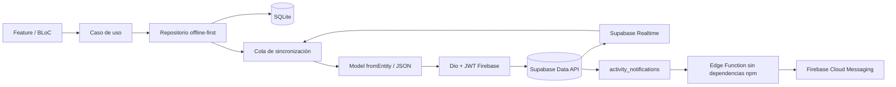

# Supabase, sincronización y alertas

## Arquitectura adoptada

La app es **offline-first**. SQLite sigue siendo la fuente de verdad que observa
la interfaz; Supabase es el respaldo compartido y el canal de colaboración.



- `supabase_flutter` inicializa Supabase y mantiene Realtime.
- Dio realiza Data API, RPC y Storage mediante un adaptador único.
- Firebase Auth sigue siendo el proveedor de identidad.
- `RegisterEventModel` y `AgendaEventModel` traducen entidad, SQLite y JSON.
- RLS autoriza por membresía del círculo de cuidado, no por la UI.
- Un cambio Realtime no escribe directamente: despierta la misma cola que hace
  pull, resuelve conflictos y actualiza SQLite.

## Qué se sincroniza hoy

| Información | Destino | Estado |
|---|---|---|
| Alimentación, sueño, pañal, observación, medicamento y medición | `register_events` | Implementado |
| Agenda y dosis derivadas de medicamentos | `agenda_events` | Implementado |
| Fotos de observaciones | bucket privado `register-event-media` | Implementado |
| Membresía mínima por bebé | `babies`, `baby_caregivers` | Implementado en backend |
| Tokens FCM por dispositivo | `push_devices` | Implementado |
| Alertas para otros cuidadores | `activity_notifications` + FCM | Implementado en backend |

Todavía son locales `families`, el perfil completo del bebé, miembros e
invitaciones de la pantalla Familia, `health_events`, `health_measurements` y
preferencias. Antes de sincronizarlos conviene aplicar el mismo patrón:
entidad, modelo `fromEntity`, tabla local con estado de sync, RPC idempotente,
RLS por `baby_caregivers`, pull incremental y pruebas de conflicto.

No se debe subir:

- JWT, refresh token, contraseña o `service_role`;
- `sync_status`, `sync_error` y cursores locales;
- rutas locales como `photo_paths`;
- configuración visual puramente local, salvo decisión explícita de producto;
- logs que contengan tokens, claves o datos clínicos.

## Configuración paso a paso

### 1. Crear el proyecto

1. Crea el proyecto en Supabase.
2. En **Project Settings > API Keys**, copia la **Project URL** y la
   **Publishable key** (`sb_publishable_...`).
3. En **Integrations > Data API**, verifica que Data API esté habilitada y que
   `public` sea un esquema expuesto.

La publishable key identifica a la app y puede estar en el binario móvil. No
autoriza datos por sí sola: RLS y el JWT del usuario son la seguridad real.

### 2. Conectar Firebase Auth

1. En **Authentication > Third-Party Auth**, agrega Firebase.
2. Usa el Project ID `bebeapp-313a4`.
3. Desde un backend confiable con Firebase Admin, asigna el custom claim
   `role: authenticated` a los usuarios.
4. Después de asignar el claim, fuerza una renovación del ID token o vuelve a
   iniciar sesión.

La migración también valida `iss` y `aud` del JWT para que un token de otro
proyecto Firebase no pase las políticas.

### 3. Crear el esquema remoto

Abre **SQL Editor** y ejecuta, en este orden:

1. `supabase/migrations/202608100001_create_register_event_sync.sql`
2. `supabase/migrations/202608100002_create_agenda_event_sync.sql`
3. `supabase/migrations/202608100003_create_care_circle_notifications.sql`

Las migraciones crean tablas, índices, RPC idempotentes, RLS, Storage,
Realtime, círculos de cuidado, tokens y alertas. Para esta preparación no es
necesario ejecutar `npm`, `npx` ni instalar paquetes JavaScript.

### 4. Configurar la app

Copia el ejemplo:

```powershell
Copy-Item apps/bebe_app/config/supabase.dart-defines.example.json `
  apps/bebe_app/config/supabase.local.json
```

Completa solamente:

```json
{
  "SUPABASE_URL": "https://PROJECT_REF.supabase.co",
  "SUPABASE_PUBLISHABLE_KEY": "sb_publishable_..."
}
```

`supabase.local.json` está ignorado por Git. Ejecuta:

```powershell
flutter run -d android `
  --dart-define-from-file=apps/bebe_app/config/supabase.local.json
```

Si las variables faltan, la capa remota queda deshabilitada y la app continúa
trabajando en SQLite.

### 5. Configurar alertas push

1. En Firebase Console crea una cuenta de servicio destinada a FCM HTTP v1.
2. En Supabase **Edge Functions**, crea `send-activity-notification` usando
   `supabase/functions/send-activity-notification/index.ts`.
3. La función no importa paquetes npm; usa únicamente `fetch` y Web Crypto de
   Deno.
4. Configura estos secretos sólo en el servidor:
   - `FIREBASE_SERVICE_ACCOUNT_JSON`
   - `ACTIVITY_WEBHOOK_SECRET`
5. `SUPABASE_URL` y `SUPABASE_SERVICE_ROLE_KEY` son provistos por Supabase a la
   función. Nunca copies `SUPABASE_SERVICE_ROLE_KEY` a Flutter.
6. En **Database Webhooks**, crea un webhook para `INSERT` sobre
   `public.activity_notifications` hacia la función.
7. Agrega el header `x-webhook-secret` con el mismo valor de
   `ACTIVITY_WEBHOOK_SECRET`.

La app registra el token FCM también en `push_devices`. El trigger de base
crea una alerta para todos los cuidadores del bebé excepto quien hizo el
cambio; la función envía FCM incluso si la app receptora está cerrada.

### 6. Preparar dos cuidadores

El primer registro de un bebé ejecuta `bootstrap_baby` de forma idempotente y
crea al usuario como `owner`. Para agregar otra cuenta se debe invocar
`add_baby_caregiver` desde un flujo autenticado del propietario, pasando el UID
Firebase del segundo usuario.

Durante desarrollo también se puede insertar la membresía desde SQL Editor:

```sql
insert into public.baby_caregivers (baby_id, user_id, role, can_write)
values ('BABY_ID', 'FIREBASE_UID', 'caregiver', true)
on conflict (baby_id, user_id) do update
set role = excluded.role, can_write = excluded.can_write;
```

El identificador demo `local-active-baby` no sirve para múltiples familias en
producción. El onboarding definitivo debe crear un UUID estable por bebé y
persistirlo local/remotamente antes del primer registro.

## Cómo se maneja el token de sesión

El token **no se guarda en la base de datos**.

1. Firebase Auth conserva la sesión mediante su SDK y almacenamiento seguro de
   plataforma.
2. `SessionRepository.getIdToken(forceRefresh: false)` obtiene un JWT vigente.
3. El interceptor Dio añade en cada petición:

```text
apikey: <SUPABASE_PUBLISHABLE_KEY>
Authorization: Bearer <FIREBASE_ID_TOKEN>
```

4. Si Supabase responde `401`, se solicita una vez el token con
   `forceRefresh: true` y se reintenta la petición una sola vez.
5. Postgres lee `auth.jwt()->>'sub'`; las políticas verifican la membresía del
   usuario en `baby_caregivers`.
6. Al cerrar sesión se retira el token FCM del dispositivo y Firebase elimina
   la sesión local.

La publishable key y el JWT cumplen funciones distintas: la primera identifica
la aplicación; el segundo identifica al usuario. Una `service_role` omite RLS
y por eso sólo puede existir en componentes de servidor.

## Flujo de escritura, sync y alerta

1. El formulario valida y guarda en SQLite con `pending`.
2. La UI recibe el cambio inmediatamente desde el stream local.
3. La cola convierte la entidad con `Model.fromEntity`.
4. Dio llama `apply_register_event` o `apply_agenda_event`.
5. El RPC hace upsert last-write-wins y conserva tombstones.
6. Un trigger inserta una alerta única para los demás cuidadores.
7. Realtime despierta el pull en otros dispositivos conectados.
8. El webhook invoca la función y FCM alerta dispositivos en background.
9. El evento local pasa a `synced`; un error queda `failed` para reintento.

La sincronización se intenta al iniciar, al autenticarse, después de mutar, al
recibir Realtime y al volver desde segundo plano.

## Consultas Data API usadas por Dio

- Pull inicial: `GET /rest/v1/register_events?select=*&order=updated_at.asc,id.asc`
- Pull incremental: añade `updated_at=gt.<cursor UTC>`.
- Upsert seguro: `POST /rest/v1/rpc/apply_register_event`.
- Agenda: mismos patrones con `agenda_events` y `apply_agenda_event`.
- Storage: `/storage/v1/object/register-event-media/<baby>/<evento>/<archivo>`.

La UI y los BLoC nunca conocen estas URLs; dependen de casos de uso y
repositorios.

## Verificación mínima

1. Usuario A inicia sesión y registra una alimentación sin red: aparece local
   con estado pendiente.
2. Al recuperar red, la fila aparece en Supabase y queda sincronizada.
3. Usuario B, miembro del mismo bebé, recibe el pull Realtime y una alerta.
4. Usuario C, sin membresía, obtiene cero filas o `403`.
5. Editar desde B y eliminar desde A converge en ambos equipos sin resucitar el
   tombstone.
6. Una foto sólo puede abrirse por miembros autorizados.
7. Rotar o revocar la sesión produce un único refresh/reintento, nunca un loop.
8. Cerrar sesión elimina el token FCM del dispositivo.

## Referencias

- [Quickstart oficial de Supabase para Flutter](https://supabase.com/docs/guides/getting-started/quickstarts/flutter)
- [Paquete `supabase_flutter`](https://pub.dev/packages/supabase_flutter)
- [Firebase como Third-Party Auth](https://supabase.com/docs/guides/auth/third-party/firebase-auth)
- [API keys de Supabase](https://supabase.com/docs/guides/getting-started/api-keys)
- [Cambios de base de datos con Realtime](https://supabase.com/docs/guides/realtime/subscribing-to-database-changes)
